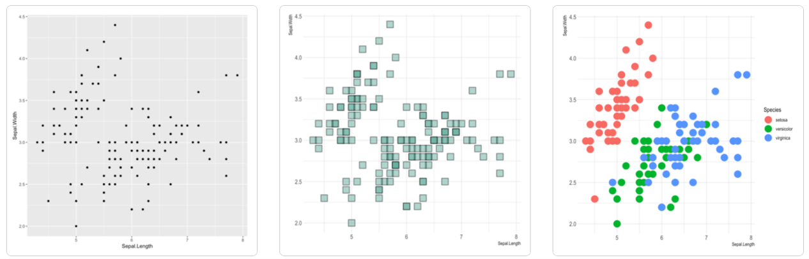
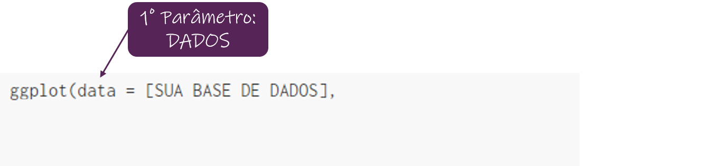
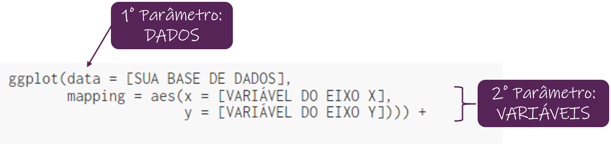
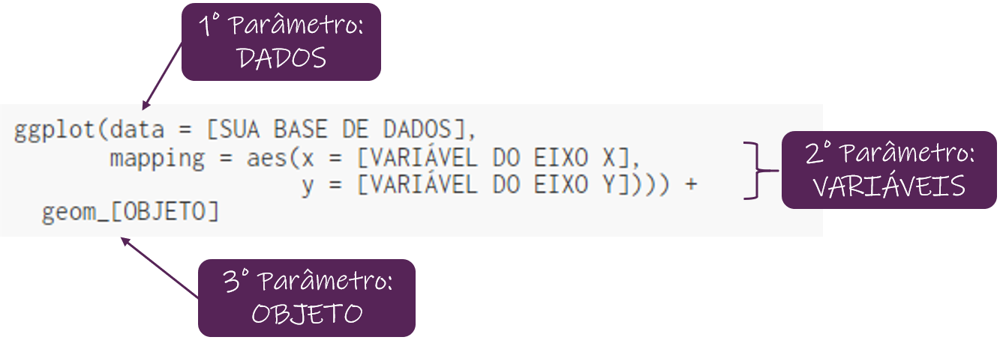
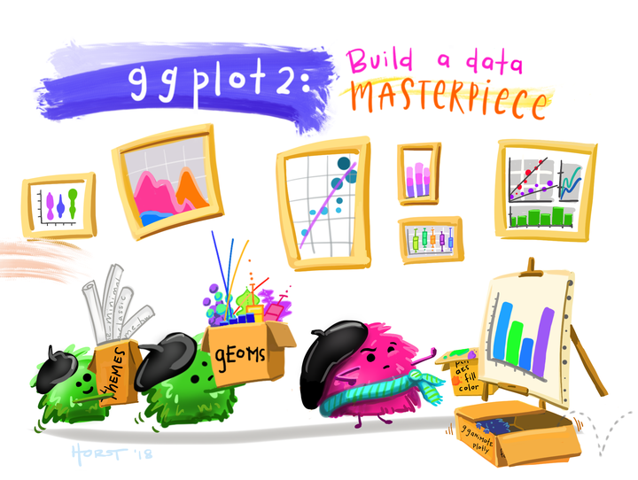

```{r pacotes_e_dados, include=FALSE}
library(ggplot2)
library(dplyr)
library(janitor)
library(extrafont)
library(friends)

loadfonts()

```

class: inverse, center, middle

# GGPLOT2

---

# ggplot2

Existem diversas formas de fazer gráficos no R

Uma delas é utilizando o pacote **_ggplot2_**


### Por que usar esse pacote? 

+ faz gráficos elegantes
+ muito versátil
+ implementa a "gramática dos gráficos" 


--

# Instalação

```{r eval=FALSE, tidy=FALSE}
install.packages("ggplot2")
library(ggplot2)
```

---

# "Gramática dos Gráficos" 

* É uma ferramenta que segue uma abordagem para descrever e construir gráficos de maneira estruturada

* Um [artigo](http://vita.had.co.nz/papers/layered-grammar.pdf) propôs uma parametrização alternativa dessa gramática em 2005

* Traz a ideia de construir um gráfico a partir de várias **camadas**

* As ideias desse artigo foram implementadas no **_ggplot2_**

.center[]

---

# Como construir um gráfico?

### Dados

Para criar um gráfico, a primeira coisa que a gente precisa é escolher nossos dados. 

--

### Mapear o que queremos plotar

  * qual variável queremos colocar no eixo x?
  * qual variável queremos colocar no eixo y?
  
--

### Definir qual o objeto geométrico queremos criar

  * ponto?
  * linha?
  * barras?

--

### ... Melhorar a estética

---

# Dados 

Para os exemplos dessa apresentação, vou usar dados da série **Friends**.  
Pra quem quiser rodar os exemplos, é só instalar o pacote `install.packages("friends")`.

```{r dados_friends}
# Carregando os dados 
df_friends_info <- friends::friends_info
head(df_friends_info)
```

.center[]

---

# Mapear o que queremos plotar 

Quero dar uma olhada na relação entre o total de visualizações e a avaliação que o episódio recebeu pelo imdb. 
Então vou querer plotar no eixo x us_views_millions e no eixo y a variável imdb_rating. 

```{r} 
# Variáveis escolhidas  
df_friends_info %>% 
  select(us_views_millions, imdb_rating) %>% 
  head()
```

---

# Definir o objeto geométrico

Como as duas variáveis escolhidas são numéricas e eu quero ver a relação entre elas, eu vou escolher fazer um gráficos de pontos.

<br />

.center[]


---

# Estrutura Básica do ggplot2

--

## Dados 

.center[]

---

# Estrutura Básica do ggplot2

## Variáveis

.center[]

---

# Estrutura Básica do ggplot2

## Objeto geométrico

.center[]

---

### Gráfico de dispersão das visualizações pela nota do episódio

```{r eval=FALSE, tidy=FALSE}
ggplot(data = df_friends_info,
       mapping = aes(x = us_views_millions, 
                     y = imdb_rating)) + 
  geom_point()
```

--

```{r echo=FALSE, fig.align='center', fig.dim=c(7,6)}
ggplot(data = df_friends_info,
       mapping = aes(x = us_views_millions, 
                     y = imdb_rating)) + 
  geom_point()
```

---

# Objetos Geométricos

- Gráficos de dispersão: `geom_point()`

- Gráficos de barras: `geom_col()` ou `geom_bar()`

- Gráficos de linhas: `geom_line()`

- Histograma: `geom_hist()`

- Boxplot: `geom_boxplot()`

- Densidade: `geom_density()`

- Suavização: `geom_smooth()`

- Adicionar rótulos ou textos: `geom_label()` ou `geom_text()`

---

## Parâmetros dos Objetos Geométricos

Todos esses objetos geométricos possuem elementos estéticos. Por exemplo:

### geom_point()

Os parâmetros disponíveis são:

- **x**: variável do eixo x
- **y**: variável do eixo y 
- **alpha**: controla a transparência dos pontos
- **colour**: define a cor dos pontos 
- **fill**: define a cor de preenchimento dos pontos
- **group**: agrupa os dados por outra variável
- **shape**: define o formato dos pontos
- **size**: define o tamanho dos pontos
- **stroke**: define o tamanho da borda dos pontos

[Saiba mais sobre o geom_point()](https://ggplot2.tidyverse.org/reference/geom_point.html)

---

### Gráfico de dispersão das visualizações pela nota do episódio
Vamos **colorir** os pontos de acordo com a temporada que aquele episódio pertence

```{r eval=FALSE, tidy=FALSE}
ggplot(data = df_friends_info,
       mapping = aes(x = us_views_millions, 
                     y = imdb_rating,
*                    colour = factor(season))) + 
  geom_point()
```

--

```{r echo=FALSE, fig.align='center', fig.dim=c(8,5)}
ggplot(data = df_friends_info,
       mapping = aes(x = us_views_millions, 
                     y = imdb_rating,
                     colour = factor(season))) + 
  geom_point()
```


---
class: inverse, middle

# Vamos fazer um exemplo colocando mais algumas camadas?

--

1. Fazer um boxplot da variável *us_views_millions* pela variável *season*

--

2. Adicionar uma **camada** que mostra o valor da média como um ponto no gráfico

--

3. Adicionar uma **camada** que exibe o valor da mediana como texto

--

4. Adicionar uma **camada** de texto que identifica quais são os 2 episódios mais assistidos (outliers)

---

**Obs:** para colocar as medidas (mediana e média) no gráfico, criei uma outra base chamada **df_friends_agrup**.  
E para identificar os episódios mais assistidos, criei uma base chamada **top_2**.

```{r message=FALSE, warning=FALSE}
# Agrupa os dados para pegar a média e mediana
df_friends_agrup <- df_friends_info %>% 
  dplyr::group_by(season) %>% 
  dplyr::summarise(mean_views = mean(us_views_millions),
                   median_views = median(us_views_millions))


# Seleciona os 2 episódios mais assistidos 
top_2 <- df_friends_info %>% 
  arrange(desc(us_views_millions)) %>% 
  select(season, title, us_views_millions) %>% 
  head(4) %>% 
  distinct()
```


---

### 1. Boxplot

```{r}
parte_1 <- 
  ggplot() + 
  geom_boxplot(data = df_friends_info, 
               mapping = aes(x = factor(season),
                             y = us_views_millions,
                             fill = factor(season)))
```

--

```{r echo=FALSE, fig.dim=c(11,6)}
parte_1
```

---

### 2. Boxplot + Média

```{r}
parte_1e2 <- 
  parte_1 +
  geom_point(data = df_friends_agrup,
             mapping = aes(x = factor(season),
                           y = mean_views),
             colour = "yellow", size = 2)
```

--

```{r echo=FALSE, fig.dim=c(11,6)}
parte_1e2
```

---

### 3. Boxplot + Média + Mediana (texto)

```{r}
parte_1e2e3 <- parte_1e2 +
  geom_text(data = df_friends_agrup,
            mapping = aes(x = factor(season),
                          y = median_views,
                          label = format(median_views, digits = 1, nsmall = 1)),
            fontface = "bold", size = 4, vjust = -0.5)
```

--

```{r echo=FALSE, fig.dim=c(11,6)}
parte_1e2e3
```


---

### 4. Boxplot + Média + Mediana (texto) + Top 2 (texto)

```{r}
parte_1e2e3e4 <- parte_1e2e3 +
  geom_label(data = top_2,
            mapping = aes(x = factor(season),
                          y = us_views_millions,
                          label = title))
```

--

```{r echo=FALSE, fig.dim=c(11,6)}
parte_1e2e3e4
```

---

## Código completo ... 
```{r eval=FALSE, tidy=FALSE}
ggplot() + 
  # Camada 1
  geom_boxplot(data = df_friends_info, 
               mapping = aes(x = factor(season),
                             y = us_views_millions,
                             fill = factor(season))) + 
  # Camada 2 
  geom_point(data = df_friends_agrup,
             mapping = aes(x = factor(season),
                           y = mean_views),
             colour = "yellow", size = 2) + 
  # Camada 3
  geom_text(data = df_friends_agrup,
            mapping = aes(x = factor(season),
                          y = median_views,
                          label = format(median_views, digits = 1, nsmall = 1)),
            fontface = "bold", size = 4, vjust = -0.5) +
  # Camada 4
  geom_label(data = top_2,
            mapping = aes(x = factor(season),
                          y = us_views_millions,
                          label = title))
```


---

## Resultado ... 

```{r echo=FALSE, fig.align='center', fig.dim=c(12,7)}
ggplot() + 
  # Camada 1
  geom_boxplot(data = df_friends_info, 
               mapping = aes(x = factor(season),
                             y = us_views_millions,
                             fill = factor(season))) + 
  # Camada 2 
  geom_point(data = df_friends_agrup,
             mapping = aes(x = factor(season),
                           y = mean_views),
             colour = "yellow", size = 2) + 
  # Camada 3
  geom_text(data = df_friends_agrup,
            mapping = aes(x = factor(season),
                          y = median_views,
                          label = format(median_views, digits = 1, nsmall = 1)),
            fontface = "bold", size = 4, vjust = -0.5) +
  # Camada 4
  geom_label(data = top_2,
            mapping = aes(x = factor(season),
                          y = us_views_millions,
                          label = title))
```


---
class: inverse, middle

### Já sabemos fazer um gráfico simples   😄

### E agora já sabemos como adicionar mais camadas    😄

--

# Como mexer no estilo do gráfico ? 
# Como deixar ele dentro do padrão da apresentação, por exemplo?

---

### Quase tudo no **ggplot2** pode ser modificado. 

Existe uma folhinha de _"cola"_ ([cheatsheet](https://github.com/rstudio/cheatsheets/blob/master/data-visualization-2.1.pdf)) que nos motra todos os parâmetros que podemos adicionar em cada um dos objetos geométricos.  
Ela também mostra que podemos alterar o título do gráfico, título dos eixos, podemos alterar as cores. Uma infinidade de alterações podem ser feitas nas camadas. 

.center[

]

---

### Quais as camadas de estilo que eu mais uso ???

`labs()`: essa **camada** altera o título do gráfico, o título do eixo y, e título do eixo x.
```{r eval=FALSE, tidy=FALSE}
grafico + 
  labs(title = "Título do meu gráfico",
       x = "Título do meu eixo x",
       y = "Título do meu eixo y")
```

`scale_fill_brewer()`: essa **camada** altera as cores do `fill` que acrescentamos no boxplot, por exemplo:
```{r eval=FALSE, tidy=FALSE}
grafico + 
  scale_fill_brewer(name = "Temporada", palette = "Set3")
```

`theme_bw()`, `theme_minimal()`, `theme_classic()`: essa **camada** altera o tema do gráfico:
```{r eval=FALSE, tidy=FALSE}
grafico + 
  theme_bw()
```

---

# theme()

Essa camada é uma forma de customizar os componentes do seu gráfico que não envolvem os dados. Por exemplo: fonte do título, tamanho do título, cor dos textos, tamanho da legenda, etc...  
Normalmente, é a camada que eu deixo por último!

### O que você consegue alterar com essa camada?

* **plot.title**: título do gráfico (fonte, tamanho, cor, posição)
* **axis.title**: título dos eixos (fonte, tamanho, cor, posição)
* **legend.background**: cor do fundo da legenda

Se quiser ver tudo que é possível ser alterado, só clicar nesse [link aqui](https://ggplot2.tidyverse.org/reference/theme.html)!

---

# Vamos deixar aquele boxplot mais bonito?

```{r include=FALSE}
boxplot_anterior <- ggplot() + 
  # Camada 1
  geom_boxplot(data = df_friends_info %>% filter(season > 5), 
               mapping = aes(x = factor(season),
                             y = us_views_millions,
                             fill = factor(season))) + 
  # Camada 2 
  geom_point(data = df_friends_agrup %>% filter(season > 5),
             mapping = aes(x = factor(season),
                           y = mean_views),
             colour = "orange", size = 2) + 
  # Camada 3
  geom_text(data = df_friends_agrup %>% filter(season > 5),
            mapping = aes(x = factor(season),
                          y = median_views,
                          label = format(median_views, digits = 1, nsmall = 1)),
            fontface = "bold", size = 5, vjust = -0.5,
            family= "Ink Free") +
  # Camada 4
  geom_label(data = top_2 %>% filter(season > 5),
            mapping = aes(x = factor(season),
                          y = us_views_millions,
                          label = title, fill = factor(season)),
            family= "Ink Free", size = 6, fontface = "bold")
```


```{r eval=FALSE, tidy=FALSE}
boxplot_anterior + 
  # Alterando os títulos
  labs(title = "Boxplot Us Million Views x Temporada",
       x = "Temporada",
       y = "Us Million Views") + 
  
  # Alterando a cor para roxo
  scale_fill_brewer(name = "Temporada", palette = "Set3") + 
  
  # Alterando o tema
  theme_bw() + 
  
  # Alterando fontes e tamanhos ... 
  theme(plot.title = element_text(family = "Ink Free", 
                                  size = 20,
                                  face = "bold",
                                  colour = "#562457",
                                  hjust = 0.5),
        text = element_text(family = "Ink Free"),
        axis.title = element_text(size = 17, face = "bold"),
        axis.text = element_text(size = 15, face = "bold"),
        legend.text = element_text(size = 15, face = "bold"),
        legend.title = element_text(size = 17, face = "bold"))
```


---

### Resultado ...

```{r echo=FALSE, fig.align='center', fig.dim=c(10,7)}
boxplot_anterior + 
  # Alterando os títulos
  labs(title = "Boxplot Us Million Views x Temporada",
       x = "Temporada",
       y = "Us Million Views") + 
  
  # Alterando a cor para roxo
  scale_fill_brewer(name = "Temporada", palette = "Set3") + 
  # Alterando o tema
  theme_bw() + 
  # Alterando fontes e tamanhos ... 
  theme(plot.title = element_text(family = "Ink Free", 
                                  size = 20,
                                  face = "bold",
                                  hjust = 0.5),
        text = element_text(family = "Ink Free"),
        axis.title = element_text(size = 17, face = "bold"),
        axis.text = element_text(size = 15, face = "bold"),
        legend.text = element_text(size = 15, face = "bold"),
        legend.title = element_text(size = 17, face = "bold"))
```

---

class: inverse, middle, center


## Obrigada!

.center[]
<small> Artwork by @allison_horst </small>

Slides criados usando o pacote [**xaringan**](https://github.com/yihui/xaringan).  
Todo o material está disponível no [**github!**](https://github.com/lodthomaz/ggplot2_RLadiesSP)  
Link da apresentação: [https://lodthomaz.github.io/ggplot2_RLadiesSP/#1](https://lodthomaz.github.io/ggplot2_RLadiesSP/#1)
Siga as RLadies SP no [**instagram**](https://instagram.com/rladiessaopaulo?igshid=1ij2ofwaxkr2q)  😄 


---

## Exemplinho extra com geom_col !!!

Dentro do pacote de `friends` tem uma base com as emoções de cada cena das 4 temporadas iniciais.  
Quero saber tem alguma temporada com mais cenas neutras que as demais, por exemplo. 

```{r message=FALSE, warning=FALSE}
# Dados 
df_emotions <- friends::friends_emotions

# Agrupando a base emotions por temporada e emoção 
emotions_agrup <- df_emotions %>% 
  dplyr::group_by(season, emotion) %>% 
  dplyr::summarise(qtde = n()) %>% 
  mutate(qtde_percent = qtde / sum(qtde))

head(emotions_agrup, 4)
```

---

### Exemplinho extra com geom_col !!!
<small>
Para ver a proporção de cada emoção nas temporadas, podemos fazer um gráfico de barras que some 100%.
</small>

```{r eval=FALSE, tidy=FALSE}
emotions_agrup %>% # dados que agrupamos no slide anterior 
  ggplot() + 
  geom_col(mapping = aes(x = season, y = qtde,
                         fill = emotion,  # vamos preencher as barras de acordo com a emoção
                         group = emotion), 
           position = 'fill',     # esse parâmetro faz a barra somar 100%
           color = "black") + 
  geom_label(aes(x = season, y = qtde, group = emotion,
                 label = scales::percent(qtde_percent,accuracy = .1)),  # ajusta o label para percentual
             position = position_fill(vjust = 0.5), family= "Ink Free", fontface = "bold", size=4) +
  scale_y_continuous(labels = scales::percent) + 
  # Alterando os títulos
  labs(title = "Proporção de Emoções por Temporada",
       x = "Temporada",
       y = "Proporção de Emoções (%)") + 
  # Alterando a cor da paleta
  scale_fill_brewer(name = "Temporada", palette = "Set3") + 
  # Alterando o tema
  theme_bw() + 
  # Alterando fontes e tamanhos ... 
  theme(plot.title = element_text(family = "Ink Free", size = 20, face = "bold", hjust = 0.5),
        text = element_text(family = "Ink Free"),
        axis.title = element_text(size = 17, face = "bold"),
        axis.text = element_text(size = 15, face = "bold"),
        legend.text = element_text(size = 15, face = "bold"),
        legend.title = element_text(size = 17, face = "bold"))
 
```


---

## Resultado ...

```{r echo=FALSE, fig.align='center', fig.dim=c(11,8)}
emotions_agrup %>% # dados que agrupamos no slide anterior 
  ggplot() + 
  geom_col(mapping = aes(x = season, y = qtde,
                         fill = emotion,  # vamos preencher as barras de acordo com a emoção
                         group = emotion), 
           position = 'fill',     # esse parâmetro faz a barra somar 100%
           color = "black") + 
  geom_label(aes(x = season, y = qtde, group = emotion,
                 label = scales::percent(qtde_percent,accuracy = .1)),  # ajusta o label para percentual
             position = position_fill(vjust = 0.5), family= "Ink Free", fontface = "bold", size=5) +
  scale_y_continuous(labels = scales::percent) + 
  # Alterando os títulos
  labs(title = "Proporção de Emoções por Temporada",
       x = "Temporada",
       y = "Proporção de Emoções (%)") + 
  # Alterando a cor da paleta
  scale_fill_brewer(name = "Temporada", palette = "Set3") + 
  # Alterando o tema
  theme_bw() + 
  # Alterando fontes e tamanhos ... 
  theme(plot.title = element_text(family = "Ink Free", size = 20, face = "bold", hjust = 0.5),
        text = element_text(family = "Ink Free"),
        axis.title = element_text(size = 17, face = "bold"),
        axis.text = element_text(size = 15, face = "bold"),
        legend.text = element_text(size = 15, face = "bold"),
        legend.title = element_text(size = 17, face = "bold"))
```


